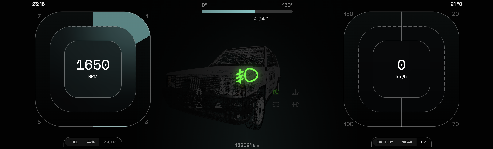

# 🚗 Cyberpandino Cluster - PandaOS

[](https://www.gnu.org/licenses/gpl-3.0)
[](https://github.com/cyberpandino/cluster/releases)
[](https://nodejs.org/)
[](https://www.raspberrypi.com/)
[](https://github.com/cyberpandino/cluster/blob/main/.github/CONTRIBUTING.md)

Quadro strumenti digitale per Fiat Panda 141 basato su Raspberry Pi 4B.

## 📋 Descrizione

Sistema completo di quadro strumenti digitale che sostituisce la strumentazione analogica originale della Fiat Panda 141. Il sistema si interfaccia con la centralina tramite protocollo OBD-II (ELM327) e legge le spie luminose tramite optoaccoppiatori collegati ai pin GPIO del Raspberry Pi.

### Caratteristiche Principali (v0.9.0)

- ✅ **Lettura dati OBD-II**: Velocità, giri motore, temperatura, pressione olio, etc.
- ✅ **Rilevamento spie veicolo**: Abbaglianti, anabbaglianti, frecce, livello olio, etc.
- ✅ **Sensori esterni**:
  - Temperatura esterna (DS18B20)
  - Livello carburante (ADS1115)
- ✅ **Gestione quadro accensione**: Sistema di power-saving automatico
- ✅ **Interfaccia moderna**: Dashboard 3D con modello Panda interattivo
- ✅ **Modalità demo**: Per sviluppo senza hardware

---

## 📸 Anteprima

### Dashboard Principale

Il cluster digitale sostituisce completamente il quadro strumenti analogico originale con un'interfaccia moderna e personalizzabile.

<div align="center">
  
  <p><em>Dashboard principale con modello 3D interattivo</em></p>
</div>

---

### 🗺️ Feature Future

Scopri cosa stiamo pianificando: [Roadmap & Wishlist](ROADMAP.md)

Alcune idee in lista:
- 📹 Retrocamera e sensori parcheggio
- 🚪 Animazioni 3D avanzate (portiere, luci)
- 🎨 Dashboard e temi personalizzabili
- 🌍 Internazionalizzazione
- 📱 App mobile companion
- E molto altro!

Vuoi contribuire? Ogni aiuto è benvenuto! Vedi la [guida per contribuire](.github/CONTRIBUTING.md).

---

## 📚 Indice della Documentazione

### 🚀 Inizia Qui
- **[Quick Start](QUICK_START.md)** - Guida rapida per iniziare subito
- **[Hardware](HARDWARE.md)** - Lista completa componenti e schema di montaggio

### 📖 Documentazione Tecnica
- **[Architettura](ARCHITETTURA.md)** - Architettura dettagliata del sistema
- **[Documentazione Generale](DOCUMENTAZIONE.md)** - Overview completa del progetto
- **[Configurazione Client](client/CONFIGURAZIONE.md)** - Setup e configurazione frontend
- **[Configurazione Server](server/CONFIGURAZIONE_SERVER.md)** - Setup e configurazione backend
- **[Configurazione Environment](client/src/config/README.md)** - Variabili d'ambiente e parametri

### 🤝 Contribuzione
- **[Come Contribuire](.github/CONTRIBUTING.md)** - Guida completa per contribuire al progetto

### 📋 Altro
- **[Roadmap](ROADMAP.md)** - Piano di sviluppo e wishlist
- **[Autori](AUTHORS.md)** - Chi ha contribuito al progetto
- **[Licenza](LICENSE)** - GNU General Public License v3.0

---

## ⚠️ Disclaimer

PandaOS è un progetto hobbistico e sperimentale, nato per curiosità tecnica e spirito di avventura digitale. Non è un prodotto certificato, non è pensato per la produzione e non ha alcuna pretesa di rispettare standard industriali, automotive o galattici.

Tutto il materiale presente in questo repository, inclusi codice, guide, schemi e idee più o meno sensate, è fornito "AS IS", senza garanzie di funzionamento, affidabilità o compatibilità con l'impianto elettrico della vostra eroica utilitaria.

Gli autori e i contributori non si assumono alcuna responsabilità in caso di:

* guasti elettrici o elettronici
* comportamenti anomali del veicolo
* cortocircuiti imprevisti
* danni a persone, cose, animali e simili
* qualsiasi effetto collaterale derivante dall'uso del software o dal seguire le istruzioni presenti in questa documentazione

L'utilizzo di PandaOS su veicoli in circolazione o in qualsiasi contesto in cui potrebbero essere richiesti requisiti di conformità, omologazione o buon senso è fortemente sconsigliato. Qualsiasi installazione o sperimentazione avviene a rischio esclusivo dell'utente, che si assume ogni responsabilità in merito alle conseguenze tecniche e pratiche delle proprie scelte.

---

## 🏗️ Architettura

Il progetto è composto da tre moduli principali:

```
cluster/
├── client/          → Interfaccia grafica (React + Vite + Electron)
├── server/          → Backend comunicazione OBD-II e GPIO (Node.js)
└── main.js          → Wrapper Electron per desktop app
```

### Tecnologie Utilizzate

- **Frontend**: React 18, TypeScript, Three.js, Socket.IO Client
- **Backend**: Node.js, Socket.IO Server, SerialPort, GPIO (onoff)
- **Desktop**: Electron 36
- **Hardware**: Raspberry Pi 4B, ELM327, DS18B20, ADS1115

### 🤔 Ma React + Electron su un Automotive?! Siete Pazzi?

Sì, lo sappiamo. Qualsiasi ingegnere embedded che vede questo progetto probabilmente sta avendo un attacco di panico.

**Come andrebbero fatte le cose per bene:**
- **C/C++** - Perché JavaScript su un'auto è come mettere le ruote quadrate
- **Qt/QML** - Lo standard dell'industria (Tesla, Audi, BMW lo usano)
- **Yocto/Buildroot** - Linux embedded serio, non Raspberry Pi OS con tutto il ciarpame
- **Direct framebuffer** - Non Electron che gira un intero browser per mostrare 4 numeri

**E allora perché React/Electron/Node.js?**

Perché è un **progetto hobbistico** e vogliamo **divertirci**, non impazzire.

**Pro del nostro approccio discutibile**:
- ⚡ **Veloce da sviluppare** - Hai visto Three.js? Fai un modello 3D in 5 minuti. Prova con OpenGL nativo.
- 🎨 **Librerie ovunque** - npm ha tutto. C++ ha... ehm... boost?
- 🧑‍💻 **Accessibile** - Sai React? Benvenuto. Sai CMake? Condoglianze.
- 🐛 **Debug** - F12 e vedi tutto. GDB invece è... un'esperienza.
- 🚀 **Divertimento** - Più tempo a smanettare, meno a lottare con toolchain
- 💡 **Prova il concetto** - Funziona? Bene! Poi si vedrà.

**Contro (che accettiamo consapevolmente)**:
- 💾 **Mangia RAM** come fosse pasta (~500MB vs ~50MB)
- 🐌 **Boot lento** (~30s vs ~3s) - ma con modalità standby sempre acceso diventa istantaneo
- 🔋 **Consuma** più di quanto dovrebbe (ma standby consuma solo 0.4W, trascurabile)
- 📊 **JavaScript** - Sì, JavaScript. Su un'auto. Deal with it.

**Il punto è**: Stiamo parlando di una **Panda del 1990**. Non è un F-35. Non deve andare sulla Luna.  
Deve mostrarti i giri motore in modo figo mentre ascolti i Pink Floyd. E questo lo fa benissimo. 🚗💨

> 💡 **Vuoi rifarlo in C++/Qt "come si deve"?** Fantastico! Saremmo curiosi di vedere un port nativo e ti aiuteremmo volentieri.

---

## ⚙️ Requisiti di Sistema

### Prerequisiti Software

| Software | Versione Minima | Consigliata |
|----------|----------------|-------------|
| **Node.js** | 18.0.0 | 20.x LTS |
| **npm** | 9.0.0 | 10.x |
| **Git** | 2.0+ | Latest |

```bash
# Verifica rapida
node --version  # >= v18.0.0
npm --version   # >= 9.0.0
git --version   # >= 2.0.0
```

⚠️ **Raspberry Pi**: Non usare `apt install nodejs` (versione obsoleta). Vedi [CONFIGURAZIONE_SERVER.md](server/CONFIGURAZIONE_SERVER.md#2-installazione-nodejs-e-npm) per NodeSource/nvm.

---

### Per Raspberry Pi (Produzione)

- **Hardware**:
  - Raspberry Pi 4B (4GB o superiore consigliato) o Raspberry Pi 5
  - Adattatore ELM327 USB (porta seriale `/dev/ttyUSB0`)
  - Optoaccoppiatori per rilevamento spie (PC817 o simili)
  - Display LCD ultra-wide (1920×480 consigliato)
  - Sensore temperatura DS18B20 (opzionale)
  - Convertitore ADC ADS1115 (opzionale, per sensore carburante)

📋 **Lista completa hardware**: Vedi [HARDWARE.md](HARDWARE.md) per dettagli su tutti i componenti necessari

- **Sistema Operativo**:
  - Raspberry Pi OS Lite (64-bit) - Debian-based consigliato
  - Boot time: ~30s (ottimizzabile a ~20s, o istantaneo con modalità standby)
  - Architettura ARM/ARM64
  
  > 📘 **Scelta OS e Boot Time**: Vedi [CONFIGURAZIONE_SERVER.md](server/CONFIGURAZIONE_SERVER.md#1-installazione-sistema-operativo) per dettagli su come scegliere la distro giusta, ottimizzare il boot time e configurare la modalità **standby sempre acceso** (consumo trascurabile, avvio istantaneo)

- **Software**: Vedi [CONFIGURAZIONE_SERVER.md](server/CONFIGURAZIONE_SERVER.md#2-installazione-nodejs-e-npm) per istruzioni installazione su Raspberry Pi

### Per Sviluppo Locale (Mac/Windows/Linux)

- Node.js 18+ (20 LTS consigliato)
- npm 9+ (10.x consigliato)
- Git 2.0+

> 💡 **Setup Veloce**: Vedi istruzioni installazione nella sezione [Prerequisiti Software](#prerequisiti-software) sopra

⚠️ **NOTA**: Eseguendo il progetto su sistemi non-Raspberry Pi, il server fallirà all'avvio per mancanza di dipendenze hardware specifiche (GPIO, sensori, porta seriale OBD). È possibile usare la **modalità mock** nel client per sviluppo senza server.

---

## 🚀 Setup del Progetto

### 1. Clonare il Repository

```bash
git clone https://github.com/cyberpandino/cluster
cd cluster
```

### 2. Installare le Dipendenze

Il progetto fornisce uno script di installazione che configura tutte le dipendenze:

```bash
npm run install:all
```

Questo comando installa le dipendenze per:
- Root (Electron + concurrently)
- Client (React + dipendenze frontend)
- Server (Node.js + dipendenze hardware)

### 3. Configurazione

#### a) Configurazione Client

Modifica il file di configurazione client:

**File**: `client/src/config/environment.ts`

```typescript
export const environment: EnvironmentConfig = {
  websocket: {
    url: 'http://127.0.0.1:3001',  // URL del server WebSocket
    mock: true,                      // true = modalità demo | false = connessione reale
    reconnectionAttempts: 3,
    reconnectionDelay: 1000,
    timeout: 5000,
  },
  debug: {
    enabled: true,                   // Abilita debug mode
    showConsoleViewer: true,         // Mostra console viewer (tasto 'd')
  },
  app: {
    name: "PandaOS Cluster",
    version: "0.9.0",
    locale: "it",
    timezone: "Europe/Rome",
    timeFormat: "24h",
  },
};
```

**Parametri Chiave**:
- `websocket.url`: Indirizzo del server WebSocket (default: `http://127.0.0.1:3001`)
- `websocket.mock`: 
  - `true` = Modalità demo con animazioni simulate (per sviluppo locale)
  - `false` = Connessione reale al server (per produzione su Raspberry Pi)
- `debug.enabled`: Abilita funzionalità di debug
- `debug.showConsoleViewer`: Mostra console viewer (attivabile con tasto `d`)

#### b) Configurazione Server

Modifica il file di configurazione GPIO e sensori:

**File**: `server/config/gpio-mapping.js`

Vedi la sezione [Configurazione GPIO](#-configurazione-gpio-e-sensori) per i dettagli completi.

---

## 🎯 Avvio del Progetto

### Modalità Completa (Raspberry Pi)

Avvia client, server ed Electron contemporaneamente:

```bash
npm start
```

Questo comando esegue:
1. Server OBD-II sulla porta 3001
2. Client React/Vite sulla porta 5173
3. Electron desktop app

### Modalità Sviluppo (Locale senza Raspberry)

#### Opzione 1: Solo Client (Modalità Mock)

1. Assicurati che `websocket.mock = true` in `client/src/config/environment.ts`
2. Avvia solo il client:

```bash
npm run client
```

L'applicazione sarà disponibile su `http://localhost:5173` con dati simulati.

#### Opzione 2: Client + Electron

```bash
npm run client    # In un terminale
npm run electron  # In un altro terminale
```

### Comandi Individuali

```bash
# Solo server (richiede Raspberry Pi)
npm run server

# Solo client
npm run client

# Solo Electron (attende client su porta 5173)
npm run electron
```

---

## 🔌 Configurazione GPIO e Sensori

### Mappatura GPIO per Spie Veicolo

Il file `server/config/gpio-mapping.js` contiene la mappatura completa dei pin GPIO.

> 📘 **Schema Elettrico Veicolo**: Per identificare i cavi corretti delle spie sul quadro originale della Panda, consulta lo [Schema Elettrico Ufficiale Fiat Panda 141](http://www.bunkeringegnere.altervista.org/esplosi/FIAT%20PANDA/panda%20141/1100%20mpi/55%20IMPIANTO%20ELETTRICO%20-%20SCHEMI%20-%20GAMMA%202000.pdf) con tutti i codici colore e le connessioni.

#### Pin Utilizzati

| Spia/Funzione | Pin GPIO (BCM) | Descrizione |
|---------------|----------------|-------------|
| Frecce | 17 | Indicatori di direzione |
| Alternatore | 27 | Carica batteria |
| Pressione olio | 22 | Pressione olio motore |
| Sistema frenante | 23 | Freni |
| Iniettori | 24 | Sistema iniezione |
| Quadro acceso (KEY) | 25 | Chiave inserita |
| Abbaglianti | 5 | Fari abbaglianti |
| Anabbaglianti | 6 | Fari anabbaglianti |
| Quattro frecce | 12 | Luci emergenza |
| Fendinebbia | 13 | Fendinebbia posteriore |
| Temperatura raffreddamento | 16 | Liquido refrigerante |
| Termoresistenza lunotto | 19 | Sbrinatore lunotto |
| Riserva carburante | 20 | Livello carburante basso |
| Ignition (quadro) | 21 | Rilevamento quadro acceso/spento |

#### Configurazione Optoaccoppiatori

```javascript
config: {
  mode: 'BCM',              // Numerazione Broadcom GPIO
  pullMode: 'PUD_DOWN',     // Resistenza pull-down interna
  debounceTime: 50,         // Filtro anti-rimbalzo (ms)
  pollingInterval: 100,     // Frequenza lettura GPIO (ms)
}
```

**Logica di Funzionamento**:
- `HIGH (1)` = Spia accesa
- `LOW (0)` = Spia spenta

### Gestione Quadro Accensione (Ignition)

```javascript
ignition: {
  enabled: true,
  pin: 21,                  // Pin GPIO dedicato
  activeOn: 0,              // 0 = active low | 1 = active high
  scripts: {
    lowPower: './scripts/low-power.sh',   // Eseguito quando quadro si spegne
    wake: './scripts/wake.sh',             // Eseguito quando quadro si accende
  },
}
```

Gli script di power-saving possono essere personalizzati per:
- Spegnere display
- Ridurre luminosità
- Disabilitare servizi non essenziali
- Avviare shutdown controllato

### Sensore Temperatura Esterna (DS18B20)

```javascript
temperature: {
  enabled: true,
  sensorId: null,           // null = auto-detect primo sensore
  basePath: '/sys/bus/w1/devices',
  readInterval: 5000,       // Intervallo lettura (ms)
  pin: 4,                   // GPIO 4 (default per 1-Wire)
}
```

**Setup Hardware**:
1. Collegare DS18B20 al GPIO 4
2. Abilitare 1-Wire: `sudo raspi-config` → Interface Options → 1-Wire
3. Verificare presenza sensore: `ls /sys/bus/w1/devices/`

### Sensore Carburante (ADS1115 - ADC I2C)

```javascript
fuel: {
  enabled: true,
  chip: 0,                  // 0 = ADS1115 | 1 = ADS1015
  channel: 0,               // Canale A0 (0-3 disponibili)
  gain: 4096,               // ±4.096V full-scale
  sampleRate: 250,          // Sample rate (SPS)
  readInterval: 500,        // Intervallo lettura (ms)
  
  // Configurazione partitore resistivo
  voltageDivider: {
    r1: 100000,             // 100kΩ
    r2: 33000,              // 33kΩ
  },
  
  // Calibrazione tensione → percentuale
  calibration: {
    voltageEmpty: 0.5,      // Tensione serbatoio vuoto (V)
    voltageFull: 4.0,       // Tensione serbatoio pieno (V)
  },
  
  pins: {
    sda: 2,                 // GPIO 2 (SDA I2C)
    scl: 3,                 // GPIO 3 (SCL I2C)
  },
}
```

**Setup Hardware**:
1. Collegare ADS1115:
   - VDD → 3.3V
   - GND → GND
   - SDA → GPIO 2
   - SCL → GPIO 3
   - A0 → Sensore carburante (tramite partitore resistivo)
2. Abilitare I2C: `sudo raspi-config` → Interface Options → I2C
3. Verificare presenza: `sudo i2cdetect -y 1`

### Porta Seriale OBD-II

**File**: `server/services/OBDCommunicationService.js`

```javascript
constructor() {
  this.portPath = '/dev/ttyUSB0';  // Porta ELM327
  this.port = null;
  this.baudRate = 38400;            // Velocità comunicazione
}
```

**Setup Hardware**:
1. Collegare adattatore ELM327 via USB
2. Verificare porta: `ls -l /dev/ttyUSB*`
3. Dare permessi: `sudo usermod -a -G dialout $USER`
4. Riavviare o ri-login per applicare permessi

**Configurazione Porta Seriale Alternativa**:

Se l'adattatore OBD è su una porta diversa (es. `/dev/ttyUSB1`, `/dev/ttyACM0`), modificare:

```javascript
// In server/services/OBDCommunicationService.js (riga 7)
this.portPath = '/dev/ttyUSB1';  // Modifica qui
```

---

## 🔧 Configurazione PM2 (Avvio Automatico)

Per eseguire il server come servizio di sistema su Raspberry Pi:

### 1. Installare PM2

```bash
sudo npm install -g pm2
```

### 2. Configurare Ecosystem

Modifica `server/ecosystem.config.js`:

```javascript
module.exports = {
  apps: [{
    name: 'obd-server',
    script: './server.js',
    cwd: '/home/pi/cockpit/server',  // ⚠️ MODIFICA QUESTO PATH
    instances: 1,
    autorestart: true,
    watch: false,
    max_memory_restart: '200M',
    restart_delay: 2000,
    max_restarts: 15,
    min_uptime: '10s',
    exp_backoff_restart_delay: 100,
    env: {
      NODE_ENV: 'production',
      PORT: 3001
    },
    log_file: './logs/obd-combined.log',
    out_file: './logs/obd-out.log',
    error_file: './logs/obd-error.log',
    log_date_format: 'YYYY-MM-DD HH:mm:ss Z',
    merge_logs: true
  }]
};
```

### 3. Avviare con PM2

```bash
cd server
mkdir -p logs
pm2 start ecosystem.config.js
pm2 save
pm2 startup
```

### 4. Comandi PM2 Utili

```bash
pm2 status              # Stato servizi
pm2 logs obd-server     # Visualizza log
pm2 restart obd-server  # Riavvia servizio
pm2 stop obd-server     # Ferma servizio
pm2 monit               # Monitor in tempo reale
```

---

## 🛠️ Troubleshooting

### Server non si avvia su sistema non-Raspberry

**Errore**:
```
❌ ERRORE: Dipendenze Raspberry Pi essenziali non disponibili
Piattaforma non supportata: darwin arm64 - richiesto Linux ARM
```

**Soluzione**: 
- Usa la modalità mock nel client (`websocket.mock = true`)
- Oppure esegui il server solo su Raspberry Pi

### Errore installazione: Python 3.13 / node-gyp incompatibile

**Errore** (durante `npm install` nel server):
```
gyp ERR! stack TypeError: Cannot assign to read only property 'cflags'
gyp info using node-gyp@7.1.2
gyp info using Python version 3.13.5
```

**Causa**: La dipendenza `epoll` (usata da `onoff` per GPIO) ha una versione vecchia di `node-gyp` incompatibile con Python 3.13+.

**Soluzioni**:

**Opzione 1: Installazione con --ignore-scripts (Consigliata per dev)**
```bash
cd server
npm install --ignore-scripts
```

Questo salta la compilazione delle dipendenze native (GPIO, SerialPort). Perfetto per:
- ✅ Sviluppo su laptop/desktop
- ✅ CI/CD pipelines
- ✅ Sistemi con Python 3.13+
- ❌ NON funziona su Raspberry Pi (serve compilare)

**Opzione 2: Downgrade Python (solo se necessario per Raspberry)**
```bash
# Installa Python 3.11 (compatibile con node-gyp)
sudo apt install python3.11
sudo update-alternatives --install /usr/bin/python3 python3 /usr/bin/python3.11 1
```

**Opzione 3: DEV_MODE (sviluppo server)**
```bash
cd server
npm install --ignore-scripts
DEV_MODE=true node server.js
```

⚠️ In DEV_MODE il server parte ma non è funzionale (niente GPIO/OBD). Usa solo per test.

**Nota**: Le dipendenze hardware (`onoff`, `serialport`, `ads1x15`) sono `optionalDependencies` - falliscono senza bloccare l'installazione delle altre dipendenze.

### ELM327 non trovato

**Errore**:
```
Porta /dev/ttyUSB0 non trovata
```

**Soluzione**:
1. Verifica porta: `ls -l /dev/ttyUSB*`
2. Controlla permessi: `sudo usermod -a -G dialout $USER`
3. Modifica porta in `OBDCommunicationService.js` se diversa

### Sensore temperatura non trovato

**Avviso**:
```
⚠️ Sensore temperatura DS18B20 non disponibile (1-Wire non trovato)
```

**Soluzione**:
1. Abilita 1-Wire: `sudo raspi-config` → Interface Options → 1-Wire
2. Riavvia: `sudo reboot`
3. Verifica: `ls /sys/bus/w1/devices/`
4. Se non necessario, disabilita in `gpio-mapping.js`: `temperature.enabled = false`

### Sensore carburante non risponde

**Avviso**:
```
⚠️ Sensore carburante ADS1115 non disponibile
```

**Soluzione**:
1. Abilita I2C: `sudo raspi-config` → Interface Options → I2C
2. Verifica connessione: `sudo i2cdetect -y 1`
3. Controlla cablaggio ADS1115
4. Se non necessario, disabilita in `gpio-mapping.js`: `fuel.enabled = false`

### Electron non si avvia

**Errore**:
```
Error: connect ECONNREFUSED 127.0.0.1:5173
```

**Soluzione**:
Il client Vite deve essere avviato prima. Usa `npm start` che gestisce l'ordine automaticamente.

### GPIO non risponde

**Problema**: Le spie non vengono rilevate

**Soluzione**:
1. Verifica cablaggio optoaccoppiatori
2. Testa pin: `gpio readall` (installa wiringpi se necessario)
3. Controlla mappatura pin in `gpio-mapping.js`
4. Verifica logica active high/low degli optoaccoppiatori

---

## 📱 Utilizzo dell'Applicazione

### Controlli Tastiera

- **`d`**: Apri console di debug
- **`ESC`**: Chiudi console di debug
- **`r`**: Ricarica applicazione

### Console di Debug

Premi `d` per aprire la console interattiva che mostra:
- Log WebSocket
- Errori di connessione
- Dati OBD-II in tempo reale
- Stato GPIO e sensori

---

## 📦 Build per Produzione

### Build Client

```bash
cd client
npm run build
```

Output in `client/dist/`

### Build Electron

Per creare un'app distribuibile:

1. Installa electron-builder: `npm install --save-dev electron-builder`
2. Aggiungi script in `package.json`:

```json
"scripts": {
  "build:electron": "electron-builder"
}
```

3. Esegui: `npm run build:electron`

---

## 📝 Struttura File Principali

```
cluster/
├── client/
│   ├── src/
│   │   ├── config/
│   │   │   └── environment.ts          ← Configurazione client
│   │   ├── components/                 ← Componenti React
│   │   ├── routes/
│   │   │   └── Cockpit/               ← Dashboard principale
│   │   ├── services/
│   │   │   └── WebSocketService.ts    ← Gestione WebSocket client
│   │   └── store/                     ← State management (Valtio)
│   └── package.json
│
├── server/
│   ├── config/
│   │   └── gpio-mapping.js            ← ⚙️ Configurazione GPIO e sensori
│   ├── services/
│   │   ├── OBDServer.js               ← Server principale
│   │   ├── OBDCommunicationService.js ← Comunicazione ELM327
│   │   ├── GPIOService.js             ← Gestione GPIO per spie
│   │   ├── IgnitionService.js         ← Gestione quadro accensione
│   │   ├── TemperatureSensorService.js← Sensore temperatura DS18B20
│   │   └── FuelSensorService.js       ← Sensore carburante ADS1115
│   ├── scripts/
│   │   ├── low-power.sh               ← Script power-saving
│   │   └── wake.sh                    ← Script risveglio
│   ├── ecosystem.config.js            ← Configurazione PM2
│   └── package.json
│
├── main.js                            ← Wrapper Electron
└── package.json                       ← Scripts principali
```

---

## 🔒 Sicurezza e Note

- ⚠️ **Non eseguire come root**: Usa permessi utente normali con gruppo `dialout` e `gpio`
- 🔋 **Power-saving**: Gli script ignition possono proteggere il sistema da scaricamenti batteria
- 🧪 **Testing**: Usa sempre modalità mock per test senza hardware
- 📊 **Monitoring**: Usa PM2 per monitorare il server in produzione

---

## 📄 Licenza

Questo progetto è rilasciato sotto licenza **GNU General Public License v3.0 or later**.

```
PandaOS
Copyright (C) 2025  Cyberpandino

This program is free software: you can redistribute it and/or modify
it under the terms of the GNU General Public License version 3.

This program is distributed in the hope that it will be useful,
but WITHOUT ANY WARRANTY; without even the implied warranty of
MERCHANTABILITY or FITNESS FOR A PARTICULAR PURPOSE. See the
GNU General Public License for more details.
```

Il testo completo della licenza è disponibile nel file [LICENSE](LICENSE) e su https://www.gnu.org/licenses/gpl-3.0.html

---

## 👥 Contribuire

Ogni contributo è benvenuto! Che si tratti di codice, documentazione, bug report o suggerimenti.

### 🚀 Come Iniziare

1. Leggi la [guida per contribuire](.github/CONTRIBUTING.md)
2. Scegli come contribuire:
   - 🐛 [Segnala un bug](.github/ISSUE_TEMPLATE/bug_report.md)
   - ✨ [Proponi una feature](.github/ISSUE_TEMPLATE/feature_request.md)
   - ❓ [Fai una domanda](.github/ISSUE_TEMPLATE/question.md)
   - 💻 Contribuisci con codice
   - 💡 Cerca ispirazione nella [Roadmap & Wishlist](.github/CONTRIBUTING.md#-vuoi-contribuire-ma-non-hai-idee)

### 📝 Workflow Contribuzione

1. **Fork** del repository
2. **Crea un branch**: `git checkout -b feature/nome-feature`
3. **Fai le tue modifiche** seguendo lo [stile del codice](.github/CONTRIBUTING.md#-stile-del-codice)
4. **Aggiungi l'header GPL-3.0** ai nuovi file sorgente
5. **Commit**: `git commit -m 'feat: aggiunta nuova feature'` ([Conventional Commits](https://www.conventionalcommits.org/))
6. **Push**: `git push origin feature/nome-feature`
7. **Apri una Pull Request** compilando il [template](.github/PULL_REQUEST_TEMPLATE.md)

### 📋 Template Disponibili

- [🐛 Bug Report](.github/ISSUE_TEMPLATE/bug_report.md) - Segnala problemi
- [✨ Feature Request](.github/ISSUE_TEMPLATE/feature_request.md) - Proponi miglioramenti
- [❓ Domanda](.github/ISSUE_TEMPLATE/question.md) - Chiedi aiuto
- [🔀 Pull Request](.github/PULL_REQUEST_TEMPLATE.md) - Contribuisci con codice

### 💡 Cerchi Idee?

Non sai da dove iniziare? Abbiamo una [Roadmap & Wishlist](.github/CONTRIBUTING.md#-vuoi-contribuire-ma-non-hai-idee) di feature che vorremmo implementare:
- Retrocamera e sensori parcheggio
- Animazioni 3D avanzate (portiere, luci sul modello)
- Dashboard personalizzabili e temi
- Tutorial fotografici e video
- Internazionalizzazione
- E molto altro!

Consulta la [guida completa per contribuire](.github/CONTRIBUTING.md) per tutti i dettagli.

---

## 📞 Supporto

Per problemi o domande, apri una issue su GitHub.

---

## 👨‍💻 Autori

PandaOS è sviluppato e mantenuto da:

- **[Matteo Errera](https://github.com/matteoerrera)**
- **[Roberto Zaccardi](https://github.com/rzaccardi)**
- **[Ludovico Verde](https://www.instagram.com/ludovico.verdee/)**

Vedi [AUTHORS](AUTHORS.md) per la lista completa e dettagli sui contributori.

